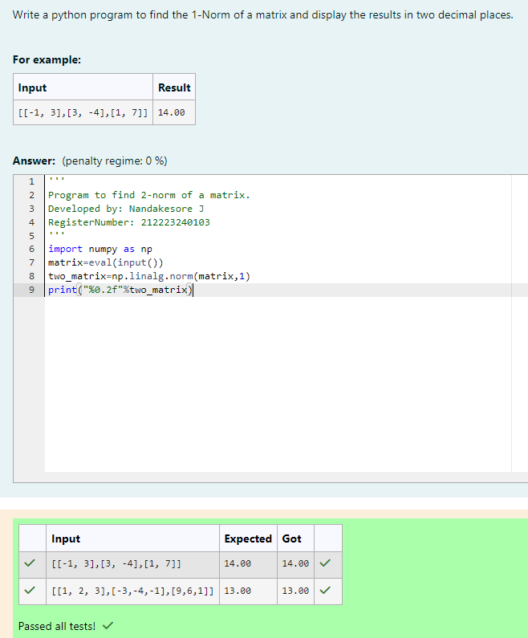
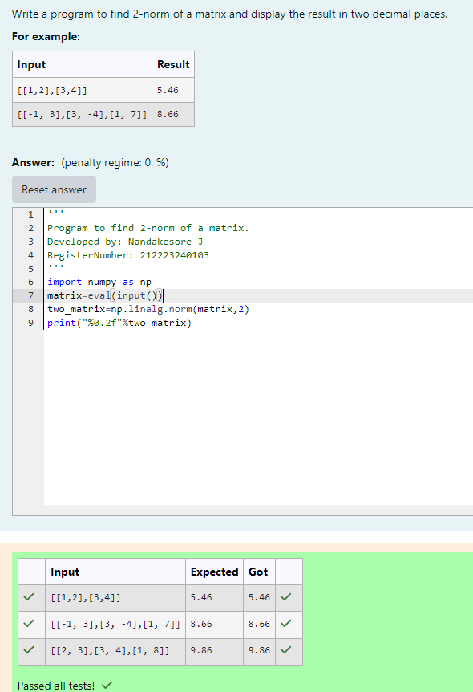
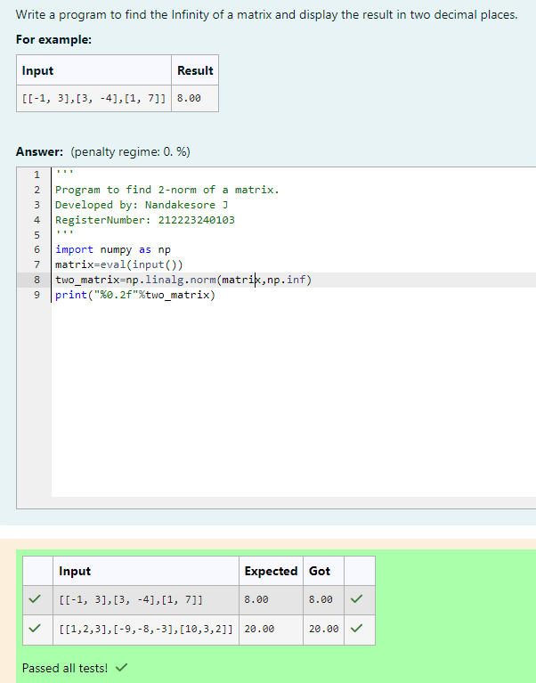

# Norm of a matrix
## Aim
To write a program to find the 1-norm, 2-norm and infinity norm of the matrix and display the result in two decimal places.
## Equipment’s required:
1.	Hardware – PCs
2.	Anaconda – Python 3.7 Installation / Moodle-Code Runner
## Algorithm:

1-Norm of a Matrix
	1. Get the input matrix using np.array().
        2. Find the 1-norm of the matrix using np.linalg.norm()
	3. Print the norm of the matrix in two decimal places.

2-Norm of a Matrix
        1. Get the input matrix using np.array()   
	
        2. Find the 2-norm of the matrix using np.linalg.norm()
	
	3. Print the norm of the matrix in two decimal places.

Infinity Norm of a Matrix
        1. Get the input matrix using np.array()   
	
        2. Find the infinite-norm of the matrix using np.linalg.norm()
	
	3. Print the norm of the matrix in two decimal places.
    
## Program:

Program to find 2-norm of a matrix.

Developed by: Nandakesore J

RegisterNumber: 212223240103

# 1-Norm of a Matrix

```
import numpy as np
matrix=eval(input())
two_matrix=np.linalg.norm(matrix,1)
print("%0.2f"%two_matrix)
```

# 2-Norm of a Matrix
```
import numpy as np
matrix=eval(input())
two_matrix=np.linalg.norm(matrix,2)
print("%0.2f"%two_matrix)
```
# Infinity Norm of a Matrix
```
import numpy as np
matrix=eval(input())
two_matrix=np.linalg.norm(matrix,np.inf)
print("%0.2f"%two_matrix)
```

## Output:
### 1-Norm of a Matrix

<br>

### 2-Norm of a Matrix

<br>

### Infinity Norm of a Matrix

<br>

## Result
Thus the program for 1-norm, 2-norm and Infinity norm of a matrix are written and verified.
